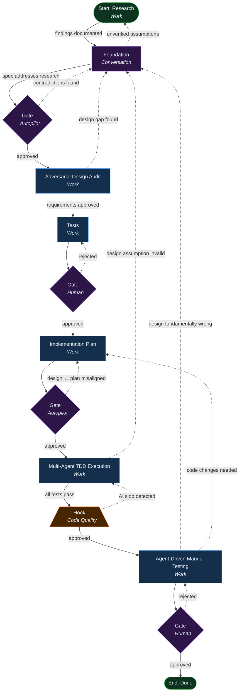

A few months back, I was on a call with engineers from all across Microsoft. We were all gearing up for an event aimed to equip engineers with the latest skills necessary to excel at AI Native Software Engineering. The side chat started to discuss both excitement about, and pains felt from using Claude's latest (at the time) Opus 4.5 model.

It was clear that this model represented a *huge* step forward, and yet there were some enduring points of pain that were still very much present.

One of the comments that stuck with me was:

> You just need a better harness [...]

I was extremely busy on that particular day -- it was a few days before a milestone birthday, I was trying to get deliverables done, while getting prepped for a trip to Destin, FL. The resultant gap between taking in that comment, and actually being able to action it, provided a wonderful opportunity -- it allowed my mind wrestle over the pain points, lessons learned, and *design* for what an ideal agent operating model[[1](#footnotes)] might look like with the most capable models.

# Enduring Pain Points of Most Capable Models

Back in November, I had read Anthropic's *[effective harnesses for long-running agents](https://www.anthropic.com/engineering/effective-harnesses-for-long-running-agents)*, and I really appreciated the **Agent failure modes and solutions** table which mapped symptoms to mitigations. Since the release of Claude's Opus 4.6 model, I've likewise tried to spend some time cataloging specific failure modes observed in practice. This is *not* novel work in the GenAI space in general -- many existing taxonomies map from underlying root causes to abstract categories of failure for LLMs/SLMs. The same research will then typically go on to propose a new benchmark system, novel model architecture, or technique(s) to employ during training. However, simply having an inverted taxonomy with systemic mitigations listed is far more useful in practice -- i.e., a taxonomy that starts from the *symptoms* engineers *actually observe* in systems headed toward production, and then maps those *symptoms* directly to *mitigation*.

While several of these failure modes collapse to the same or closely related **root causes**, the mitigations required to achieve the desired behavior surprisingly often differ materially. In some cases, the boundaries between root causes are intentionally overlapping. However, I’ve still listed these behaviors as distinct failure modes so that they remain easy to recognize and directly traceable to mitigation (e.g., **Context Anxiety** and **Drift** are both ultimately rooted in a fixed-size context window that is not being properly managed for the task at hand -- yet they manifest differently and demand different corrective strategies).

| Pain Point | Example Symptom | Example Mitigation |
| :--- | :--- | :--- |
| Over-agency | Deleting or modifying test criteria to force a successful outcome. | Enforce **deterministic** guardrails that prevent unauthorized actions, or verify task adherence after the fact (with the option of rejecting the work). |
| Speculation (Evidence-Free Reasoning) | The agent *assumes* calling some function will have a certain behavior, or that some specific root cause is to blame for some issue -- when the assumption is ultimately incorrect and was never verified. | Ground the work in **research**. Invite the agent to **experiment** and **verify** findings before acting on a false-premise[[2](#footnotes)]. Require **evidence** for all assumptions. |
| [Context Anxiety](https://www.anthropic.com/engineering/effective-harnesses-for-long-running-agents) | Lack of attention to detail/follow through. Ignoring requirements, or declaring current work as *future* work or *deferred* without explicit user consent. | Enforce **deterministic** completion checks against every requirement; perform reconciliation between requirements and the implementation plan; mandate manual or agent-driven council review of test cases. |
| [Lack of Honor](https://nickhauenstein.com/blog/2026/03/02/agents-lack-honor/) | Declaring that a task has been completed or that a step has been performed without having actually done so. | Enforce explicit evidence requirements for all declared completion points. |
| [Drift](https://arxiv.org/pdf/2510.07777) | The agent loses track of the overall goal or objective during prolonged, complex tasks. | Use fresh sessions for each distinct phase of critical work, maintaining a single task focus and providing full context upfront. |

# A better harness, or a workflow?

> As models approach "capable enough," the dominant source of failure shifts from reasoning limits, to system design failures

Anthropic solved for specific failure modes with a custom harness that sent all work through an initializer agent + coding agent that had specific instructions engineered to elicit specific behavior to setup, list, track, implement, validate, and track functionality that it was asked to develop. Consider for a moment though that the harness design targeted *specific failure modes* in a *specific version* of their model. This design will likely require iteration, refinement or expansions as new models exhibit new failure modes alongside the elimination of previous modes -- though one might argue that the system should continue to guard against failure modes that are no longer present, if those guards are not simply deterministic scripts, they carry a real cost in tokens that has to be weighed against utility.

At this point, it might be tempting to argue that teams should simply engineer their own harnesses. But does that expectation truly scale? Most engineers will operate within an off‑the‑shelf harness that brings its own execution model and constraints (plan modes, swarm orchestration, rubber duck, devils advocate, etc.), and will rarely modify it directly. The practical locus of innovation is therefore above the harness: adding or reshaping process, validation, and quality via **workflows** built on top of it (e.g., [Microsoft Conductor](https://github.com/microsoft/conductor) which might be used to drive Copilot CLI). Anthropic controls the full stack and ships their own harness; most teams won't, and shouldn't.

*"You just need a better harness"* By the time I came back to that comment -- suitcase still half‑packed, deadline behind me -- the conclusion had crystallized: A harness can mitigate known failure modes, but it is necessarily opinionated, brittle to model evolution, and owned by whoever controls the full execution stack. What we need are better **workflows**. Workflows that assume failure, demand proof, and make progress legible even when models behave poorly. That realization became the foundation for FORGED.

> **NOTE:** This is about to become an extremely long post. However, it just scratches the surface of the area that I'd like to cover. Ideally, AI would be able to translate intent *at any scale* into functionality. This *will* be addressed in later posts. For this one, we will begin with the FORGED workflow which addresses net-new functionality and/or large scale change against existing functionality that a *human team* would tackle on a timescale of 2-4 weeks.

# FORGED: Fail-first Orchestrated Research-Grounded Evidence-Driven

> Workflows that shape work are more valuable than workflows that re-do work

FORGED synthesizes practices from traditional software development methodologies, Test-Driven Development (TDD), Research → Plan → Implement (RPI) and Spec-Driven Development (SDD) patterns, and multi-agent orchestration scenarios into a single coherent pipeline with optional human checkpoints and independent verification at every state.

It imagines a **methodology** for agents codified into a **workflow** that aims to guide even the most misbehaved model to high quality outputs. The AI's role in this workflow is to *prove* that the system is working to produce high quality outputs by providing *evidence* (i.e., experiment results or citations of research verifying assumptions, test results traced to requirements, telemetry, screenshots, etc...). The human's role is to review the **evidence** that the system is working towards production high quality outputs -- not to review the output themselves.

The name captures the core properties:
- **Fail-first**: Tests before implementation. Failing tests define what "done" means before any code is written.
- **Orchestrated**: The process orchestrates multiple independent agents with trust boundaries. No agent marks its own homework.
- **Research-Grounded**: Every design decision is grounded in prior research and/or experimentation, not assumptions. The research phase runs before spec, not after.
- **Evidence-Driven**: Decisions require evidence. Alternatives are documented with rejection rationale. Validation produces artifacts (screenshots, test results), not assertions.

FORGED assumes models will misinterpret intent, overclaim completion, drift under load, optimize for perceived success, and it treats these behaviors as normal operating conditions rather than exceptional failures.

## Context engineering + optimization: Pre-generated and reconciled documentation

FORGED assumes a documentation set that evolves alongside the system it describes and that lives beyond any given FORGED workflow instance. It starts as a single document and as the system grows, splits into sub-documents describing each subsystem, with the first document serving as a sort of table of contents and index.

This documentation set is the **source of truth** for the **current state** of the system, and why it exists. It isn't a changelog, a git log, or a project plan. It is written entirely in **present tense**, describing the system as it stands **right now**. Past states live in git history; future plans live in the backlog. The documentation set only describes *what is*. It's the shared, persistent context that grounds every agent in every session. [[3](#footnotes)]

> Three workers on the same project might describe their activity as "laying a brick," "building a wall," or "building the defenses for a castle" -- they are all the same activity described. They're just being filtered through people thinking in local vs. global terms.

Every component is described at two levels: the **global why** and the **local why**. Agents need both. An agent that only knows it is laying a brick will make locally optimal decisions that may be at best globally incoherent or at worst duplicative and contradictory[[4](#footnotes)][[5](#footnotes)].

An agent that only knows about the castle may miss the detail that *this* brick goes *here* because the wall needs to bear load from a specific direction. The documentation set provides both perspectives. It aims to reflect systems thinking with full knowledge of the system -- so that every agent, in every state, can reason about both the immediate task and the broader architecture it serves.

This **current state** documentation set is referenced throughout the FORGED workflow. It is what agents in every state receive as context for understanding the system they are modifying. It has deep links directly into the code files and lines of code containing the systems described in order to save agent turns, tokens, and time spent grepping about aimlessly. But it is not the only documentation artifact in play.

FORGED produces and maintains several artifact types across its states (scoped to the current workflow instance):
- **research** artifacts: document what was learned about the problem space
- **foundation** artifacts: capture the authoritative requirements, alternatives, and architecture
- **plan** artifacts: decompose the design into concrete agent assignments and phased work

Each of these serves a different purpose, and the integrity of the pipeline depends on their alignment:

- The **design** must account for the **research** -- not ignore or contradict it
- The **plan** must implement the **design** -- not contradict or silently diverge from it
- The **current state** documentation set must reflect the system that emerges from executing the **plan** on top of what existed before

These artifact types have very different lifetimes. The **current state documentation set** is permanent. It lives with the code and is referenced by every instance of the state machine (every run of the workflow). The **research**, **foundation**, and **plan** artifacts, by contrast, are scoped to a specific run of the workflow. They are the working documents for a particular change. They are produced, consumed, and completed within that instance. They can be retained in the repo for historical reference, but they are not cross-referenced by future workflow instances per se[[6](#footnotes)].

> When any of these fall out of alignment during a workflow run, the reconciliation states exist to bring them back.

## Implementation Overview

In terms of implementation, it is modeled as a state-machine workflow where each state is either:
- A state where work happens
- A state where a conversation happens

Each state has:
- A mapping to the agent(s) that will perform the work for the state. Agents each bring their models, memory, and identity and expertise profiles.
- A prompt that guides the agent(s) in that state
- Allowed transitions from the current state that can be requested by agents

During each state, the agent(s) involved start with fresh context, receiving the overall goal, access to artifacts produced from previous states, pointer to the repo(s) where the code that is in question actually lives. They then follow the specific instructions for that state and produce any artifact(s) for review. Artifacts are considered separate from the code and could involve items like a design doc, screenshots, test results, etc...

### Transition Pipeline

When a **transition** is requested the transition processing pipeline kicks off.

```mermaid
flowchart LR
    ST1(["Initial State"])
    TR["Transition<br/>[🤖 Artificial Intelligence]"]
    ALTTR["Other Transition<br />[📜 or 🧠]"]
    HOOK["Hook<br/>[📜 Script]"]
    ALTHOOK["Other Hook<br/>[📜 Script]"]
    GATE["Gate<br/>[🧠 Actual Intelligence]"]
    ALTGATE["Other Gate<br/>[🧠 Actual Intelligence]"]
    ST2(["Target State"])
    ALT(["Other State"])

    ST1 -->|"work done"| TR
    TR -->|"requested"| HOOK
    HOOK -->|"approved"| GATE
    HOOK -->|"rejected"| ST1
    HOOK -->|"redirected"| ALTTR
    GATE -->|"approved"| ST2
    GATE -->|"rejected"| ST1
    GATE -->|"redirected"| ALTTR
    ALTTR -->|"request"| ALTHOOK
    ALTHOOK -->|"approved"| ALTGATE
    ALTGATE -->|"approved"| ALT
    
    style ST1 fill:#0d3321,stroke:#3fb950,color:#e6edf3
    style ST2 fill:#0d3321,stroke:#3fb950,color:#e6edf3
    style ALT fill:#0d3321,stroke:#3fb950,color:#e6edf3
    style TR fill:#132f4c,stroke:#58a6ff,color:#e6edf3
    style ALTTR fill:#132f4c,stroke:#58a6ff,color:#e6edf3
    style HOOK fill:#4a2600,stroke:#f0883e,color:#e6edf3
    style ALTHOOK fill:#4a2600,stroke:#f0883e,color:#e6edf3
    style GATE fill:#2d1548,stroke:#bc8cff,color:#e6edf3
    style ALTGATE fill:#2d1548,stroke:#bc8cff,color:#e6edf3
```

#### Transition Pipeline: Hooks

The transition itself might be an automatically approved transition (i.e., it has no hooks, or gates), or it might require evaluation before proceeding. In those cases, the transition pipeline runs deterministic scripts (i.e., Hooks) first evaluate the transition and either:
- Approve the transition if the conditions defined by each script are not satisfied (e.g., due to [CodeQL](https://codeql.github.com/) findings)
- Reject the transition providing the rejection reason as fresh context for the agents
- Redirect the transition to point to a different allowed transition, moving immediately to the hook for that transition -- with appropriate guards against infinite recursion of course.

The **reason** for the transition is provided to the agent(s) in the target state upon transition -- along with the overall transition history

Hooks are an inescapable line of defense against bad outputs progressing through the flow. But even a hoop that can't be moved or avoided can still be jumped through if it has a giant hole in the middle. As a result, they mainly serve to ensure that by the time **human intelligence** is brought into the mix, their attention is not wasted on verifiably low quality outputs.

#### Transition Pipeline: Gates

Gates are evaluated/cleared by **human intelligence**, or **artificial intelligence** in **autopilot** mode. At those gates the **artifacts** are reviewed, and just like the hook, the intelligence in question either approves the requested transition, rejects it (transitioning back to the previous state), or directs it to a different allowed transitions.

Once again, the **reason** for the transition is provided to the agent(s) in the target state upon transition -- along with the overall transition history

#### Transition Pipeline: Autopilot Mode

When operating on autopilot, a panel of language models -- *that did not produce artifacts* -- follow a gate-specific prompt, review the artifacts, provide a transition recommendation + reason, are then allowed to review each others' recommendation/reason and are then offered an opportunity to revise their recommendation given the other feedback (i.e., minority dissent is offered opportunity to sway the majority).

While **autopilot** mode reduces the cognitive load on humans, it is reserved for changes that are low‑risk -- defined as changes whose correctness can be independently and deterministically verified by gate hooks (e.g., tests, schema validation, reproducible outputs). This constraint exists because model panels still risk convergence on *plausible‑sounding* but ultimately incorrect conclusions.

> In FORGED, risk is not defined by perceived impact, but by whether incorrect decisions would be reliably rejected by the workflow itself without human judgment.

Essentially, human attention is a scarce resource, so the goal here is to spend it where it is most valuable, and let the machines "reason" over the rest.

### FORGED State Machine

The state machine is kicked off with a short description of intent. It is the core of what the human wants built. It could for example take the form of a typical user story title.

#### Start: Research State (Work)

The autonomous research protocol runs first. What it looks like depends on how we got here.

When entering from the start (the initial run), the research is about understanding the problem domain and the potential existing touch points for the requested functionality in the existing codebase.

The agents do a deep dive into who the persona is that would be asking for this functionality and what they're overall trying to accomplish -- the core [job-to-be-done (JTBD)](https://hbr.org/2016/09/know-your-customers-jobs-to-be-done). They might look at places where customers talk about their pain, hopes, and dreams (forums, support threads, reviews) to identify that JTBD. Once they've found it, they might examine competitors delivering against it, or look at studies (if relevant) for how to best solve those core problems. This is what informs and shapes the requirements that come next. Understanding the person and their context gets you to delightful designs rather than technically correct but emotionally flat ones.

The agents also examine carefully the **current state** documentation and dig into relevant code that might become relevant for the requested functionality. They identify existing interfaces, or opportunities to extract interfaces for re-use. They identify existing constraints and risks (e.g., the requested functionality requiring write access to a subsystem that was deliberately designed to be read-only from external callers).

When entering from the [`Foundation`](#foundation-state-conversation) state, this indicates that the agent(s) could not complete a design or properly draft requirements because there were too many unverified assumptions. The research then shifts to implementation questions instead. This is where code gets examined in a much more targeted way, experiments get designed and run to verify or invalidate specific assumptions, and evidence gets produced about the behavior or non-functional characteristics of specific implementation options.

> Claims without experiments are assumptions, and unresolved assumptions are (in my experience) the single most common source of failures in later states.

**Allowed transitions:**
- [`Foundation`](#foundation-state-conversation) when research is complete and findings are documented

#### Foundation State (Conversation)

A conversation between human and agent produces a specification that serves as both product requirements definition and design document. This becomes the authoritative source of *what* the system must do (requirements), *why* those requirements exist (rooted in the customers' JTBD), *how* the system achieves it (design), and *what alternatives were considered* (with explicit rejection rationale). This comes *after* [`Research`](#start-research-state-work) so that the conversation is at least *somewhat informed* and grounded in the reality of the current system and landscape.

A specification that claims an approach is viable must cite an experiment from the [`Research`](#start-research-state-work) state that proves it. Existing standards and patterns are somewhat exempt from this requirement (e.g., claiming mTLS could be used for mutual authentication is self-evident and would be a fruitless experiment). "This should work because the API exists" is not evidence. "Experiment N proved this works: connect in Xms, response in Yms, evidence attached" is evidence. If an approach hasn't been tested, the specification must say so and tag it with `ASSUMPTION`.

**Unknowns must be resolved, not deferred**. "Future optimization," "reserved for later," and "deferred" are not valid dispositions for unresolved design questions within a spec. If a specification contains an unknown that affects whether the approach works, that unknown must be resolved through research or experimentation via a request to transition back to research, wherein the [`Research`](#start-research-state-work) state will have access to the draft specification with unknowns to explore.

Allowed transitions:
- [`Research`](#start-research-state-work) when the design has too many unverified assumptions -- the agent requests a transition back to research to run experiments and verify or invalidate those assumptions before proceeding
- [`Adversarial Design Audit`](#adversarial-design-audit-state-work) when the spec addresses the research findings and the design is ready for adversarial review

Any forward transition from [`Foundation`](#foundation-state-conversation) will be rejected (typically by a gate in autopilot mode) if *contradictions are found* between the research artifacts and the specification. In that case the transition is kicked back to [`Foundation`](#foundation-state-conversation) with a note identifying the contradictions that must be reconciled before proceeding.

#### Adversarial Design Audit State (Work)

An independent agent reviews the design with the explicit goal of challenging choices, surfacing missing requirements, probing assumptions (i.e., asking "Are they true?" and "What happens if they're not?"), testing completeness (i.e., requirements have acceptance criteria, counter-arguments documented, design addresses problem in problem statement), 

When sent back to [`Foundation`](#foundation-state-conversation), the agent responds to each challenge. When the defense is sound, the design is strengthened by having the defense documented. When the challenge reveals a genuine gap, the design is revised. Both outcomes improve the artifact.

The auditor's output is a structured list of challenges, each with the designer's response and the resolution (defended, revised, or deferred to open questions).

Allowed transitions:
- [`Foundation`](#foundation-state-conversation) when the audit surfaces a genuine design gap -- missing requirement, flawed assumption, inadequate alternatives analysis
- [`Tests`](#tests-state-work) when requirements and design are approved

#### Tests State (Work)

Test scenarios with criteria and expected outcomes are added to the spec, inline with the requirements they validate.

Before the transition is requested, a coverage check verifies:
1. No acceptance criterion from any requirement is untested
1. No test exists without a corresponding criterion

In practice, I've observed that this is the single most important state. Even more important than having detailed specification is having specific test cases identified, documented, and locked-in early in the process, with known names, criteria, input and outcomes expected. This is reviewable by downstream agents and grounds the work product that they generate. It also becomes something that can be reviewed against the tests that the implementing agents write, to ensure that they have not "cheated" by either writing tests that **do not verify behavior**, **do not verify what they claim**, **do not exercise the implementation code** (i.e., they string together test doubles in test theater), **do not test anything at all** (i.e., they're placeholders for "future" implementation).

Allowed transitions:
- [`Implementation Plan`](#implementation-plan-state-work) when tests are approved. This transition **includes a gate**. A human verifies scenarios are realistic, criteria are measurable, and expected outcomes are correct

Any forward transition from [`Tests`](#tests-state-work) that is rejected by the human will be kicked back to [`Tests`](#foundation-state-conversation) with human feedback.

#### Implementation Plan State (Work)

The specification is decomposed into an implementation plan structured around **minimum viable vertical slices**, focusing on the narrowest useful end-to-end path through the system that works before any horizontal expansion. Everything else expands onto that working foundation rather than being built in parallel with it.

This prevents the primary waste mode in agent-built systems: long implementation trails across many subsystems that never produce a working artifact. Gaps in the design only surface when the system actually runs; a vertical slice forces that reckoning early, when course-correcting is cheap.

The plan targets maximum parallelism within each slice. Each plan task traces to design requirements and has acceptance criteria derived from the specifications's test list.

Allowed transitions:
- [`Multi-Agent TDD Execution`](#multi-agent-tdd-execution-state-work) when the plan is aligned with the design and ready for execution

Any forward transition from [`Implementation Plan`](#implementation-plan-state-work) will be rejected (typically by a gate in autopilot mode) if the plan implies architectural decisions the design didn't make, or design requirements have no corresponding plan tasks. In that case the transition is kicked back to [`Implementation Plan`](#implementation-plan-state-work) with a note identifying the contradictions between the specification and plan that must be reconciled before proceeding.[[7](#footnotes)]

#### Multi-Agent TDD Execution State (Work)

The steps in the plan are executed in waves of multiple agents with maximum parallelism allowed by the system.

Each plan step is executed with strict TDD. No agent both writes and evaluates its own tests. This separation is enforced by process boundaries (separate sessions, separate scripts). It prevents the common failure mode where a single agent writes tests that conveniently pass for the code it also wrote.

> **Test criteria are immutable during this state.** The implementation must satisfy the test as written.

Every agent in every state produces a work artifact describing what it did, what it found, and any assumptions that turned out to be wrong. If the implementation agent discovers that a design assumption doesn't hold (i.e., a constraint was missed, an approach doesn't work as specified), then it documents the finding in its artifact and can request a transition back to [`Foundation`](#foundation-state-conversation) rather than patching around the problem.

Allowed transitions:
- [`Agent-Driven Manual Testing`](#agent-driven-manual-testing-state-work) when all tests pass
- [`Foundation`](#foundation-state-conversation) when implementation reveals a design assumption that doesn't hold. The agent documents the finding in its work artifact and requests a design revision rather than working around it. This is an extremely expensive, but ultimately necessary transition.

Any forward transition from [`Multi-Agent TDD Execution`](#multi-agent-tdd-execution-state-work) will be rejected by a deterministic hook if any indicators of unclean code or "AI slop" are detected (one of the most common being source files that have indicators of violating the [single-responsibility principle](https://en.wikipedia.org/wiki/Single-responsibility_principle)). In that case the transition is kicked back to [`Multi-Agent TDD Execution`](#multi-agent-tdd-execution-state-work) with the complete findings from the hook.

#### Agent-Driven Manual Testing State (Work)

After initial unit + integration tests pass during the [`Multi-Agent TDD Execution`](#multi-agent-tdd-execution-state-work) state, another set of agents simulates what a human would do to verify the feature works end-to-end. Think of it as an automated UI test driven by AI using tools that control the actual interface. You get the experience of manual verification, without spending human attention on it.

Again in waves, one agent runs through the tests, taking screenshots, writing descriptions of everything observed (i.e., identifying anything that looks *off*, even if not *explicitly* part of the test). It also *optionally* captures telemetry during the tests (e.g., metrics, traces, logs, network captures) and makes it available for examination.

As test evidence is available, a separate agent reviews the evidence against the scenario criteria and overall specification (i.e., for findings outside of the scope of the specific test) and declares pass/fail.

Allowed transitions:
- [`Foundation`](#foundation-state-conversation) when end-to-end testing proves a design assumption fundamentally wrong. The implementation correctly follows the specification, the tests correctly validate the specification, but the specification itself assumed something that real-world usage proves false. Evidence from the failed ADMT informs the revision.
- [`Implementation Plan`](#implementation-plan-state-work) when test failures require code changes. Evidence from the failed ADMT informs revision to the implementation plan that focuses on targeted fixes.
- [`Done`](#end-done) when validation passes with evidence. This transition **includes a gate**. A human makes a final determination.

#### End: Done

This state is what it sounds like. Not only are the agents done with their work, but you are likely also done reading -- though that might have been some time ago unless you're an agent yourself.

## Benefits and costs

FORGED *has been demonstrated* to produce outputs that *actually work*, are clean, and keep the current generation of models in line. However, that might change as models change and exhibit new pain points and behaviors. More rigorous validation and workflow engineering work continues. 

There are certainly higher costs to run through a multi-agent, multi-state workflow vs. one-shotting or generating a simple plan and sending an agent swarm to implement. However, that is based purely on the assumption that the outcomes of each process are the same. Multiple plan + fleet/swarm implementation passes quickly multiply costs. Endless revision of one-shot vibe coding attempts in turn leads to endless cost.

The underlying assumption of all of these processes is that high quality outputs, especially those directly traced back to the customers' core JTBD, will lead to the best outcomes for the customer and business. The workflow engineering for an individual change does not capture that end-to-end interplay.

With *continuous AI systems*, the extension of the workflow (or addition of another) on the same engine with extremely long run-times on the order of weeks/months to establish a feedback loop of key metrics (e.g., adoption/retention, performance, COGS, revenue, etc......) is mechanically straightforward with an existing engine. The engineering of such a workflow to improve outcomes or fail fast and throw experiments away becomes the larger scale effort.

Engineering workflows/processes that keep models in line will likely be an ongoing concern. However, we can learn from the same models that have been demonstrated to help humans generate high quality outputs -- as humans often have similar failure modes (e.g., I've been known to *drift* as my own context fills up).

# Recommended Reading
- Feb 9, 2026 - [Minions: Stripe's one-shot, end-to-end coding agents](https://stripe.dev/blog/minions-stripes-one-shot-end-to-end-coding-agents)
- Feb 19, 2026 - [Minions: Stripe's one-shot, end-to-end coding agents - Part 2](https://stripe.dev/blog/minions-stripes-one-shot-end-to-end-coding-agents-part-2)

# Footnotes

[**1**] When a **methodology**, **workflow**, and **harness** are combined into a cohesive system, I refer to the result as an **agent operating model**.

An agent operating describes *how an organization reliably gets work done with agents*:
- the **harness** provides infrastructure and control surfaces,
- **workflows** define task structure, sequencing, and verification boundaries and
- the **methodology** governs quality, evaluation, and correctness.

For example, Stripe's agent operating model = Goose-fork harness + blueprint workflows.

As far as I can tell, the industry has not yet converged on a standard term for this combination -- likely because vendors typically tend to sell only a single layer (infrastructure or orchestration), while governance and quality methodology remain practitioner‑defined. I use the term **agent operating model** here to make this full stack explicit.

[**2**] Fun-fact -- this failure mode sits just adjacent to false-premise reasoning. However, much of the [literature on that subject](https://aclanthology.org/2025.findings-emnlp.44.pdf) makes an assumption that it would be **humans** providing these false-premises.

[**3**] While it might sound like I've essentially stated the same thing 5x, that is actually not too far off from the prompt that is used to enforce the style of the documentation set. The models have a tendency to want to tell the stories about the changes they're making and mark revisions throughout, which wastes precious context space for future agents reviewing the same.

[**4**] This is why, at least for similar reasons, one of the code quality checks that is implemented via a transition hook is a scan for "code clones". Sometimes models have a tendency to hard-code similar concepts at a local level rather than extracting common interfaces that can be shared.

[**5**] For repos that already have documentation, you don't have to generate this from scratch. You can start from what exists and augment it with intent so that there's understanding as to *why* the things that exist, exist.

[**6**] In practice they rarely need to be retained. If the current-state documentation set is properly reconciled after changes land, it already describes the implementation, its intent, and its design rationale, making the original design artifact redundant for future sessions. The plan is even more ephemeral since it contains concrete agent assignments and phased work for that specific run, which is irrelevant when making subsequent changes.

[**7**] It's worth noting that design changes during implementation are a normal, expected part of building things when it is impossible to verify all assumptions via experimentation due to the nature of the system being built. If the design says the system does X but the implementation needs to do Y, the design is lying -- and a lying design is worse than no design, because it actively misleads every agent and human who reads it. The response is to update the design in place (no appended revision sections), then reconcile the plan against it.