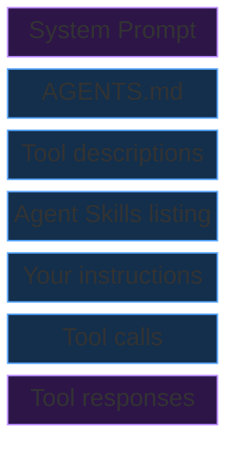

Over the last few months I've seen an increasing number of posts on LinkedIn heralding the death of MCP and the coming reign of [Agent Skills](https://agentskills.io). The same posts have replies piled on in violent agreement but claiming that in fact skills are not their death, but it's command-line interfaces instead. They up-vote each other, repeat each other, and were likely all drafted by AI anyway.

I like to pause and think critically before proclaiming anything *dead*. In fact almost nothing truly *dies* in tech. It just continues alongside other new things. If they truly replace all of the benefits, and come with none of the downsides, their adoption makes the other *obsolete*, but I'm sure there will still be someone happy enough to continue with whatever it might be.

In this case, I cannot agree with the assertion at all. It also isn't even a fight *between* the two -- as I need and use both. **I still create and use MCP servers, and I still create and use Agent Skills.**

# Myth #1: MCP servers have been replaced by Agent Skills

These are not mutually exclusive, and are often complementary.

- MCP servers provide **tools**
- Skills provide expertise *(sometimes in using those tools)* by combining:
    - Prompts/instructions
    - Scripts
    - Reference content

It's an interesting thought experiment when giving agents capabilities to go through a process that looks something like this:
1. Identify a `task` that I want the agent to do
1. Ask **myself**: If the *only* ability I had was to type or say words, what would I *immediately* ask for in order to be able to do a given task
    - What specific **tools**?
    - What specific **knowledge** that I don't already have?
1. Ask **an AI agent**: Given these **tools** and this **knowledge** what would you need to complete `task`?
    - Any other tools/information?
1. Ask **an AI agent**, given all of this, what is the process that you would go through to complete the task?
    - What parts of that are **deterministic**?
        - Of those, which parts of that are **re-usable** or **generalizable** across all tasks?
    - What parts of that benefit from more **probabilistic** behavior, or would typically involve a **human** making a judgment call?

After that, you have the ingredients you need to build:

- The **tools** are MCP servers that *might* already exists, or become candidates for new MCP servers that will be referenced within an **Agent Skill**.
- The **deterministic**, reusable behaviors become candidates for new MCP servers that will be referenced in an **Agent Skill**.
- The **probabilistic** behaviors become candidates for prompts within an **Agent Skill**.
- The **deterministic**, non-reusable behaviors become scripts within an **Agent Skill**.

## Giving AI my job

For example, if I were to consider a `task` that has often been a part of my job, I might choose **authoring technical learning content**. It's a complex task that I now consider an expertise that I have -- whether or not I'm any good at it, I will leave up to you, however I've at least spent a *large portion of my life* doing it.

That task sort of breaks down into the following:
- Research
- Synthesize
- Organize
- Stylize
- Deliver

**Research** requires access to up-to-date technical information. For example, if I were an AI trying to author content on Azure, I might use the **Microsoft Learn** MCP server which provides semantic search of content in Microsoft's official product documentation corpus. I might also use the equivalent built-in *fetch* tool of the harness that I was using at the time.

**Synthesizing** information from the research is more of a non-deterministic thing, and would require a measure of human taste/judgement if I were a human, but if I were an AI I would do my best reading/following a document that describes what that looks like -- no specific tools needed other than being able to read the research wherever it landed.

**Organizing** information is another one of those things that requires a measure of expertise. In this case, as a human I've taken inspiration over the years from *[Developing Technical Training: A Structured Approach for Developing Classroom and Computer-based Instructional Materials](https://www.amazon.com/dp/0787988464) by Ruth C. Clark*. I read it, internalized the key ideas, and now think about and DO organization differently as a result. As an Agent Skills author I would extract the most salient bits relative to organization of information (e.g., the classification into facts, concepts, processes, procedures, and principles).

**Stylizing** the information usually takes the form of turning it into a story. For that I've also relied on books as a human to learn about the subject -- and I've also learned by observation over the years. One of my favorites being *[The Writers Journey: Mythic Structure for Writers](https://www.amazon.com/dp/193290736X) by Christopher Vogler*. Again, as an Agent Skills author I might extract the Hero's Journey Cycle and include that as a reference alongside a procedural description in prompt form of how to construct a narrative that connects to the learner's life.

**Delivering** the information might again become a prompt to have the agent author an application with the ability to display or maybe use TTS to speak out loud the learning content.

# Myth #2: MCP servers are dead, use command line tools

Agents already excel with well-known tools -- `git`, `npm`, `dotnet` work great via command line.

However, MCP shines where training data doesn't:
- Custom tools need good descriptions - **command line tools not well represented in training data cost you turns and context** getting the agent up to speed
- Tool descriptions use context, but **save more** - a few tokens of description replaces rounds of trial-and-error the agent would spend fumbling with unfamiliar CLIs
- MCP tools are **easier to govern** - enable, disable, and scope individual tools (consistently supported across different harnesses)

Another aspect to consider is that when you are writing an MCP server, you can both compose and encapsulate those operations that you *want* AI agents to be able to take. You will also have **observability** of *how* AI agents *specifically* are interacting with your system(s) (i.e., they're working against interfaces expected to have AI on the other end vs. deterministic code and/or a human directly).

# Myth #3: We don't need MCP servers, agents can already call our APIs

That is true, but with similar caveats as the CLI myth.

However, I would then ask: "Given they already know how to interact with databases, why not allow them to query the database(s) your API talks to directly?"

If you have a strong reaction to that question, then I have successfully delivered the experience I have when considering your assertion that we can have agents call our APIs directly 😊

# Myth #4: We don't need MCP servers, training data covers it

We still need MCP servers for information with:
- **Recency**: the information is more recent than training data
- **Frequency**: the information is updated frequently
- **Supersession**:  the information is updated in a way that supersedes/contradicts the information before
- **Criticality** of grounded actions:  the information drives actions where errors are unacceptable

We still need MCP servers to *take action*.

# Myth #5: MCP servers are dead because they use too much context

Context is a very real consideration that requires *intentional* management because the context "cost" is not just financial cost, it's also:
- Information cost (i.e., due to early compaction)
- Task Adherence/Focus cost (i.e., due to model drift)

However, outside of the system prompt, and the responses streaming back from the tool calls themselves, you have a **ton** of control:

You control what is in **AGENTS.md** that guides agents overall, you control which tools -- and as a result -- which tool descriptions are injected into the context of each request, you control which skills are exposed to your agent, you control your own instructions and in turn as a result at least *influence* if not control the tool calls that are made.

Every one of these represents a lever you can pull to eke out token/context optimization.

When this specific pushback comes up for MCP, it is often best to ask: "How am I planning on achieving the same result without including the tool?"

If it is adding an Agent Skill because it "progressively loads" and doesn't spam the context -- that's great, but it also does potentially use a lot of context + turns + runs slower if we're not immediately handing off to scripts inside. It also begs another question: "Why not more precisely manage the tools?" or "Why not design an MCP server that uses *meta* tools with tool calls to discover tools available in certain contexts/domains?".

MCP tool context bloat sadly is often self-inflicted, and self-solvable with sufficient focus and effort. Shortcutting leads to context + time loss later that is less visible since it's not on the first turn.

# Summary

The rumors of MCP's death have been greatly exaggerated. Agents still benefit from having **tools** in the form of MCP server tools, combined with **expertise** in the form of Agent Skills, and for common, fairly stable, **command line utilities** they can readily drive those too -- provided you live dangerously or already have governance in place to ensure only specific commands are permitted.