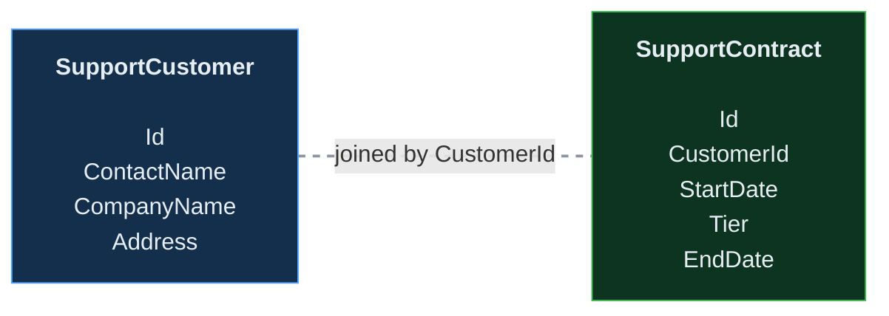
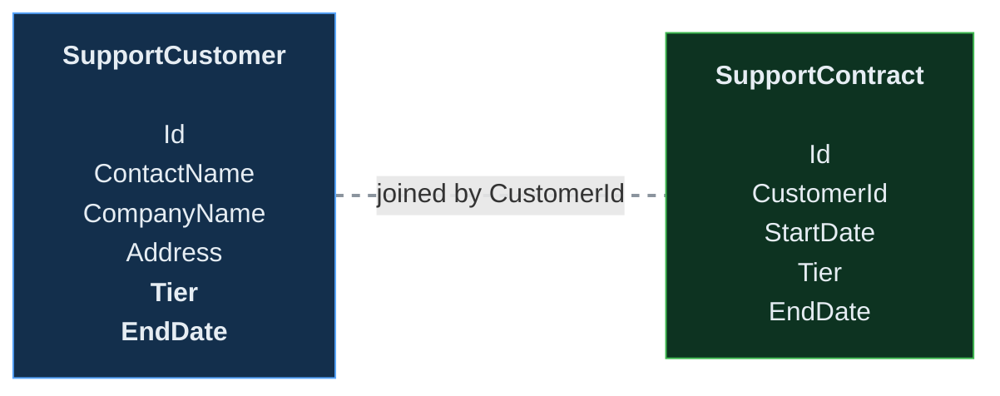
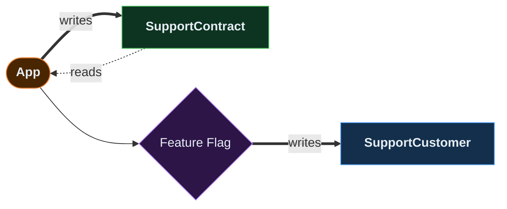
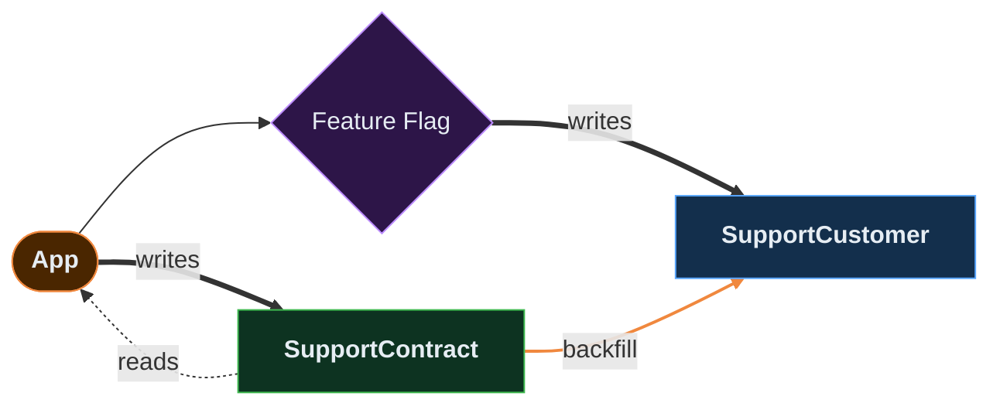
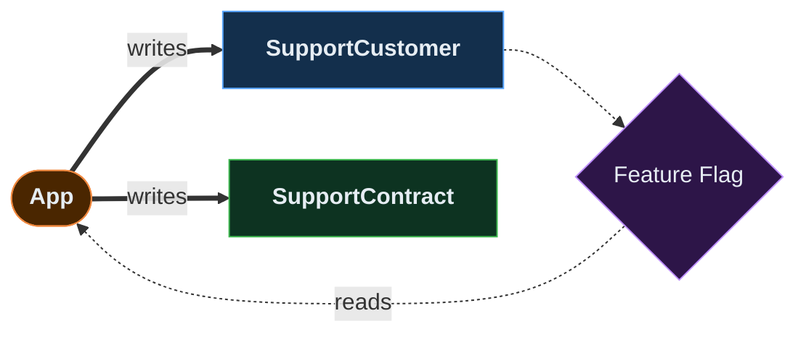
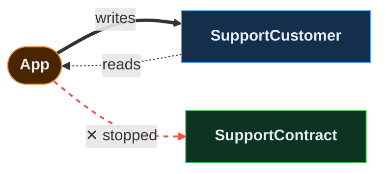

There is a level of software work that AI coding tools are going to have to get much better at if we want to use them for serious engineering work (i.e., in the production-survives-contact-with-reality sense).

In the [previous post](https://nickhauenstein.com/blog/2026/04/14/will-ai-learn-how-planning-actually-works/), I explored why AI needs to learn progressive decomposition -- honest planning that resists fake precision. Before that, [FORGED](https://nickhauenstein.com/blog/2026/03/23/addressing-enduring-pain-points/) tackled how to get correct implementations at feature scale. This post is about the third discipline: engineering the *path* so that change lands safely in a system that's already alive.

Specifically, AI needs to be able to plan and execute changes such that each incremental change represents a non-breaking expansion of functionality. Done in such a way, that each change could be safely rolled back, or rolled forward to the next expansion.

That sounds like a very normal sentence if you've spent time around production systems. It sounds almost too obvious to say:
- *Of course system changes should be forwards compatible.*
- *Of course they should remain backwards compatible.*
- *Of course you should structure change as a sequence of non-breaking expansions rather than a dramatic replacement of one working thing with another maybe-working thing.*

And yet, when I look at the current state of AI-assisted development, I see an enormous amount of energy going into the part where code appears, and much less energy going into the part where change survives.

## The Missing Layer

When humans perform mature *engineering* work, we often do something that looks inefficient from a pure programming perspective. We add the new shape of the system before deleting the old one. We write to both models. We backfill historical data. We read from the new model only after there is enough evidence that the new path is healthy. We keep a rollback path available for longer than feels aesthetically pleasing. We use feature flags to decouple deployment from exposure. We version APIs before we desperately need to version APIs. We extend instead of modify where the contract boundary demands it.

For those uninitiated by the flames of failure, this might seem like an extraordinary amount of unnecessary ceremony. But this is the work of proper *engineering*.

Consider a simple internal data model change. You have `SupportCustomer` and `SupportContract`. The contract is always queried when the customer is queried.

You do not care about contract history. `StartDate` is not serving a meaningful purpose. The obvious greenfield programmer move is to merge the contract fields into `SupportCustomer`, update the reads, update the writes, delete the old thing, and move on.

However, you also can't necessarily apply the change everywhere all at once. There are requests in flight. There are queued jobs that were serialized against the old shape and will deserialize against the new one (or try to). Depending on how widely deployed the system is, it may not even be *physically possible* to update every running instance simultaneously -- you will have old code and new code running side by side, talking to the same data store, at the same time. Is the new write path safe to read from the old code path? Is the old write path safe to read from the new code path? If not, you have a window, even if it is extremely small, where data corruption is possible.

Then there's the question of bugs that only reveal themselves in production. The new code path might be correct against every test you can write and still behave differently under real traffic patterns, real data distributions, real concurrency. You do not want that exposure hitting every customer simultaneously. You want to expose the new functionality slowly, measure it, compare it against the old path, and retain the ability to pull it back without leaving behind data that the old path can't interpret.

The proposed end state may even be the right one. The danger is in treating the end state as if it can be reached in a single motion. Even if you assume you will simply deploy last-known good, the system may have failure modes nobody has experienced yet because nobody has had to move *backwards* through the change. If you roll back, do you lose data? Does the old schema still understand what the new code wrote? Can you safely move backwards at all, or are you stuck moving forward because the bridge behind you has already burned?

This is also where driving change through modern AI models can still break down. Unless you directly challenge and prompt them to (1) consider both backwards and forwards compatibility, (2) design a strategy wherein the overall requested change could be completed as a series of non-breaking expansions of functionality with the option to go back, (3) decouple the *release* of the software bits from the *exposure* of the functionality, they will often produce the cleaner-looking destination without a safe path for getting there. In fact, in the future you might consider sharing this blog post with them before they make changes to ensure they're proceeding safely.

A more mature sequence might look like this:[[1]](#footnotes)

1. **Add the new model version** -- expand `SupportCustomer` with the fields it will eventually own.
1. **Write to both versions** -- every write path updates both `SupportCustomer` and `SupportContract`.
1. **Backfill historical data** -- copy existing contract records into `SupportCustomer`.
1. **Read from the new version behind a feature flag** -- switch reads to `SupportCustomer`, gated for rollback.
1. **Cut off writes to the old version** -- once the new read path has proven itself, stop dual-writing.

Each of these intermediate states is independently deployable. Here is what the read and write activity looks like at each step:

**Step 1: Add the new model version**

Nothing changes about reads or writes yet. You are only expanding the schema. The app still reads from and writes to `SupportContract` exactly as it did before. This is a pure additive change -- the kind of deploy you can do with zero risk because nothing depends on the new columns yet.

**Step 2: Write to both versions**

Every write path now updates both `SupportCustomer` and `SupportContract` -- but the writes to `SupportCustomer` are gated behind a feature flag. If the dual-write logic itself introduces bugs (and it can -- new serialization paths, transaction scope changes, subtle ordering issues), you flip the flag and the writes stop. Nobody is reading from `SupportCustomer` yet, so turning off the dual-write has zero customer impact. Reads of `Tier` and `EndDate` still come from `SupportContract` -- it remains the authoritative source. Old instances and new instances can coexist safely during this step because they all still read from the same place.

**Step 3: Backfill historical data**

You have been dual-writing since step 2, so all new records are represented in both places. But the historical data -- everything written before dual-writes began -- only exists in `SupportContract`. This step copies it into `SupportCustomer` so the new model has complete coverage. Once the backfill is verified, `SupportCustomer` holds the same data as `SupportContract` for every record, past and present.

**Step 4: Read from the new version behind a feature flag**

Now you switch the read path to pull from `SupportCustomer` instead of `SupportContract` -- but only for traffic gated behind a feature flag. You expose it to a small percentage of requests (or specific tenants, or internal users first) and compare the behavior against the old path. If anything looks wrong, you flip the flag and reads go back to `SupportContract` instantly. Dual-writes are still running, so both models stay current regardless of which one you are reading from.

**Step 5: Cut off writes to the old version**

After sufficient evidence that the new read path is healthy -- and after the feature flag has been fully opened -- you stop writing to `SupportContract`. At this point, `SupportCustomer` is the single authoritative source. `SupportContract` can be cleaned up later (and "later" might be weeks or months, not in the few hours you might have a Copilot CLI terminal up and running).

The precise steps above aren't the point, it's the posture behind them. Every intermediate state of the codebase should be deployable, observable, and reversible. As Mike Brittain put it when describing the culture behind Etsy's continuous deployment practice:

> "We don't optimize for being right. We optimize for detecting when we're wrong."

The five-step sequence exists because it gives you places to detect when you're wrong and respond without catastrophe. This is exactly the level that most current AI coding tools skip -- because they are still oriented almost entirely around being right on the first pass.

## A True Engineering Agent

The mature version of this world requires agents that can reason across different time scales:

1. **Commit scale:** Is this individual diff correct, tested, and consistent with the local code?
1. **Rollout scale:** Can this change be deployed dark, exposed gradually, monitored, and rolled back?
1. **Migration scale:** Can old and new system shapes coexist while data, traffic, and consumers move over?
1. **Architecture scale:** Does this change preserve contracts and leave the system easier to evolve next time?
1. **Organization scale:** Are the right humans brought in for judgment at the points where judgment is actually required?

The [planning scales](https://nickhauenstein.com/blog/2026/04/14/will-ai-learn-how-planning-actually-works/#planning-at-different-scales) I described previously -- feature, project, and production change -- tell you *when* to decompose. These reasoning scales tell you *what* each decomposed unit must account for.

Imagine opening a pull request and having an agent proactively flag that the proposed schema change is not backwards compatible with the previous deployment. Not because you asked it to do a review, but because it is continuously watching the system and understands the contract boundaries.

Imagine it saying something like:

> This change modifies the persisted representation used by `SupportCustomerReader`, but the rollback path still expects `SupportContract` to be authoritative. Consider splitting this into an expansion phase, a dual-write phase, a backfill phase, and a read-switch phase behind `ReadContractDetailsFromCustomer`.

Now imagine that instead of just outputting tokens identifying a problem:
- It prepares the plan.
- It adds the feature flags.
- It proposes the dashboard queries that tell us whether the dual-write path is healthy.
- It watches production -- and not just the metrics. We don't always know what metrics to watch. Sometimes watching what humans are telling you is better. The agent I want integrates qualitative signals too, not just error rates and latency percentiles.
- It keeps track of when the old path is eligible for deletion, potentially months later.

Most importantly, it **asks for human judgment at the places where human judgment is actually needed**.

I want AI that **can participate in the strategy of change**, execute the boring steps faithfully, and keep enough memory of the system's time horizon to know that the cleanup phase three weeks from now is part of the same piece of work.

## Continuous AI Organizations Make This Plausible

This is one reason I keep coming back to [the sweet spot](https://nickhauenstein.com/blog/2026/04/09/ai-native-software-engineering/): governed autonomy with continuous AI organizations. For certain kinds of change, the evidence should show that the change is being driven through a series of non-breaking expansions of functionality, that forwards and backwards compatibility have both been considered, and that a plan exists to carry the work all the way through rollout, observation, rollback readiness, and eventual cleanup.

That only works if the AI is continuously in operation. Not just completing a patch for 15 minutes while I doom scroll and wait to click the next "Accept dangerous operation" button.

It would instead keep the work alive across commits, deployments, production signals, and time. The human still sets intent, constraints, and judgment criteria. The agents do the follow-through (with evidence, checkpoints, and rollback rules) until the change is actually done.

There is a huge opportunity here because the current pain is real. AI can already help us write code. The next meaningful leap is helping us change systems.

## The Series

This post is the third in a series about what AI needs to learn to do real engineering at any scale. Each post addresses a different scale of change, with a different source of uncertainty:

1. **[Addressing Enduring Pain Points](https://nickhauenstein.com/blog/2026/03/23/addressing-enduring-pain-points/)** -- Feature scale. The uncertainty fits inside one bounded loop. FORGED ensures the implementation is correct.
2. **[Will AI learn how planning actually works?](https://nickhauenstein.com/blog/2026/04/14/will-ai-learn-how-planning-actually-works/)** -- Project scale. The plan itself is the uncertainty. Progressive decomposition ensures the plan is honest.
3. **The code is easy, the change is hard** (this post) -- Production change scale. The uncertainty is in the path, not the destination. Engineering change ensures the path is safe.

# Footnotes

[**1**] Before continuing with this post, I highly recommend investing an hour of your life in Mike Brittain's [Continuous Deployment: The Dirty Details](https://learn.microsoft.com/en-us/events/alm-summit-3/continuous-deployment-dirty-details). It is from long before Generative AI coding assistance existed, but it captures critical lessons that the world of AI engineering should not quickly forget because otherwise learning them comes through excruciating pain.